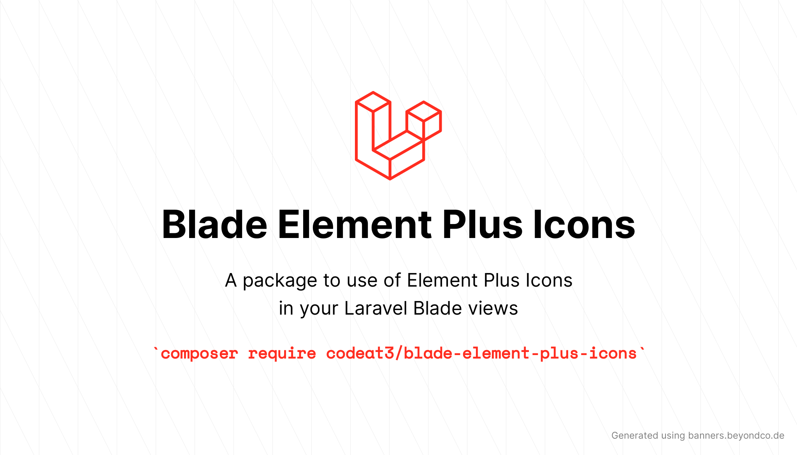

<p align="center">
    
</p>

# Blade Element Plus Icons

<a href="https://github.com/codeat3/blade-element-plus-icons/actions?query=workflow%3ATests">
    
</a>
<a href="https://packagist.org/packages/codeat3/blade-element-plus-icons">
    
</a>
<a href="https://packagist.org/packages/codeat3/blade-element-plus-icons">
    
</a>

A package to easily make use of [Element Plus Icons](https://github.com/element-plus/element-plus-icons) in your Laravel Blade views.

For a full list of available icons see [the SVG directory](resources/svg) or preview them at [element-plus.org](https://element-plus.org/en-US/component/icon.html).

## Requirements

- PHP 7.4 or higher
- Laravel 8.0 or higher

## Installation

```bash
composer require codeat3/blade-element-plus-icons
```

## Updating

Please refer to [`the upgrade guide`](UPGRADE.md) when updating the library.

## Blade Icons

Blade Element Plus Icons uses Blade Icons under the hood. Please refer to [the Blade Icons readme](https://github.com/blade-ui-kit/blade-icons) for additional functionality. We also recommend to [enable icon caching](https://github.com/blade-ui-kit/blade-icons#caching) with this library.

## Configuration

Blade Element Plus Icons also offers the ability to use features from Blade Icons like default classes, default attributes, etc. If you'd like to configure these, publish the `blade-element-plus-icons.php` config file:

```bash
php artisan vendor:publish --tag=blade-element-plus-icons-config
```

## Usage

Icons can be used as self-closing Blade components which will be compiled to SVG icons:

```blade
<x-elemplus-back/>
```

You can also pass classes to your icon components:

```blade
<x-elemplus-back class="w-6 h-6 text-gray-500"/>
```

And even use inline styles:

```blade
<x-elemplus-back style="color: #555"/>
```

### Raw SVG Icons

If you want to use the raw SVG icons as assets, you can publish them using:

```bash
php artisan vendor:publish --tag=blade-element-plus --force
```

Then use them in your views like:

```blade

```

## Changelog

Check out the [CHANGELOG](CHANGELOG.md) in this repository for all the recent changes.

## Maintainers

Blade Element Plus Icons is developed and maintained by [Swapnil Sarwe](https://swapnilsarwe.com).

## License

Blade Element Plus Icons is open-sourced software licensed under [the MIT license](LICENSE.md).
